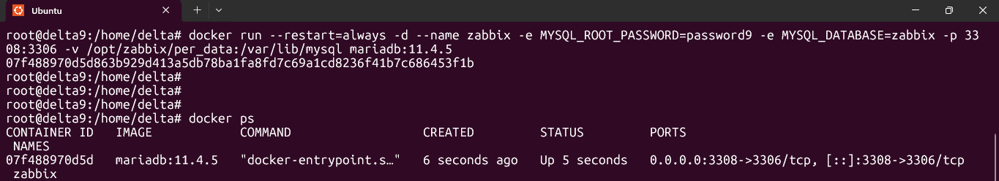
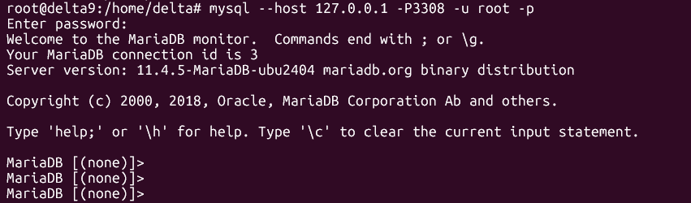
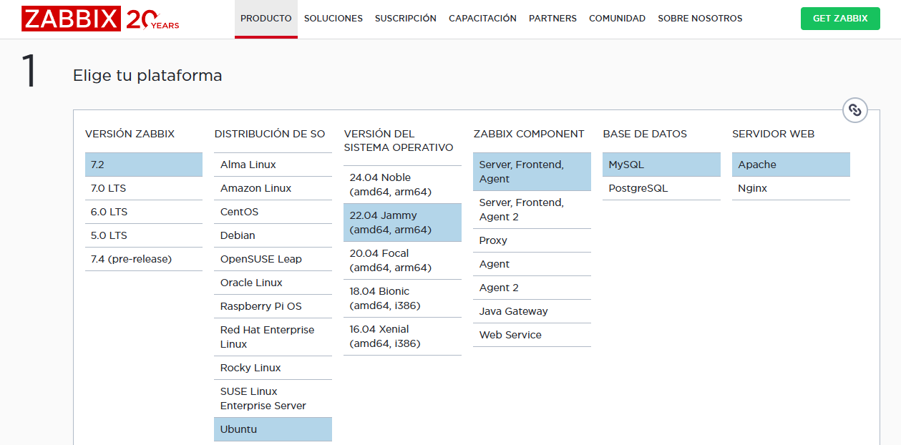
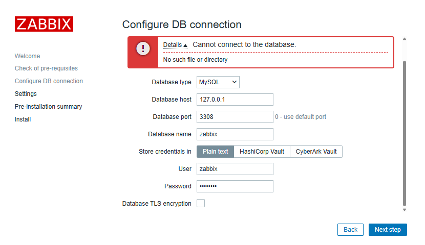

## 🛠️ Proyecto de Monitoreo con Zabbix + Base de Datos en Contenedor

Este proyecto propone una solución de monitoreo moderna basada en Zabbix, con enfoque en el despliegue y supervisión de una base de datos MariaDB ejecutada dentro de un contenedor Docker. Su diseño modular permite escalar y replicar fácilmente en entornos de desarrollo, pruebas o producción.

## 🎯 Objetivos Principales

- 📦 Desplegar una base de datos (MariaDB) en un contenedor Docker.
- 🔍 Implementar un entorno completo de monitoreo:
  - Zabbix Server
  - Zabbix Agent
  - Zabbix Frontend
- 🛠️ Configurar plantillas y elementos de monitoreo personalizados para MariaDB.
- 📚 Proveer documentación clara para facilitar la instalación, configuración y escalabilidad.

## 🔧 Tecnologías Utilizadas

- Docker
- MariaDB
- Zabbix
- Dockerfile / Docker Compose
- Bash / Python para automatización
- Sistema operativo base: Ubuntu Server

## 🚀 Primeros Pasos

### 1. Instalar Docker en el servidor

Asegúrate de tener Docker instalado antes de continuar. Este proyecto fue probado sobre Ubuntu Server.

### 2. Preparar la imagen de MariaDB

⚠️ Importante: Zabbix requiere una versión específica de MariaDB. Usar una versión incompatible puede causar errores durante la instalación.

Usaremos:

docker pull mariadb:11.4.5

### 3. Ejecutar contenedor de MariaDB

📌 Se utilizará almacenamiento persistente en `/opt/zabbix/per_data` y se expondrá el puerto `3308` hacia el contenedor.

docker run --restart=always -d \n
  --name zabbix-db
  -e MYSQL_ROOT_PASSWORD=password9
  -e MYSQL_DATABASE=zabbix
  -p 3308:3306
  -v /opt/zabbix/per_data:/var/lib/mysql
  mariadb:11.4.5

🔐 Reemplaza `password9` por una contraseña segura para producción.

### 4. Verificar conexión a la base de datos

Puedes probar la conexión desde el host:

mysql --host 127.0.0.1 -P3308 -u root -p

## ⚙️ Configurar Zabbix

Instalaremos Zabbix según la documentación oficial, utilizando la base de datos previamente desplegada.

Si es necesario, otorga permisos adicionales en la base de datos:

GRANT ALL PRIVILEGES ON zabbix.* TO 'zabbix'@'%' IDENTIFIED BY 'password';
FLUSH PRIVILEGES;

🔎 '%' permite conexiones desde cualquier IP. Para mayor seguridad, usa solo la IP específica del contenedor o la red Docker.

Nota: Un contenedor internamente crea una red la cual permite la conexion de los contenedores, claro aca debes tener en cuenta que un contenedor se puede crear con red segemntada, red de host, bridge etc, pero en este caso se crea con la red local creado por docker la cual es 172.17.0.0/16.

## 🌐 Consideraciones de Red y Seguridad

La red por defecto de Docker usa el rango 172.17.0.0/16. Si estás accediendo desde otro contenedor, la IP visible para MySQL será probablemente 172.17.0.1.

Crea el usuario con permisos específicos según la IP desde la que se conectará Zabbix:

CREATE USER 'zabbix'@'172.17.0.1' IDENTIFIED BY 'password';
GRANT ALL PRIVILEGES ON zabbix.* TO 'zabbix'@'172.17.0.1';

## 🧱 Inicializar la Base de Datos de Zabbix

Una vez creados los permisos y base de datos:

CREATE DATABASE zabbix CHARACTER SET utf8mb4 COLLATE utf8mb4_bin;
SET GLOBAL log_bin_trust_function_creators = 1;

Cargar la estructura inicial de la base de datos:

zcat /usr/share/zabbix/sql-scripts/mysql/server.sql.gz | mysql --default-character-set=utf8mb4 --host 127.0.0.1 -u zabbix -P 3308 -p zabbix

la ip del host debe ser la ip de localhost, no funcionara poner el nombre ya que este no resuelve internamente esta ip, asi que asegurate de poner la ip 127.0.0.1

## Configuración de Zabbix hacia la base de datos

En el último paso de la configuración de Zabbix, se te solicita establecer la conexión con la base de datos. Para esto, debes ingresar la IP de localhost y el puerto que expusimos; en este caso:

- IP: 127.0.0.1
- Puerto: 3308

## 🛡️ Notas de Seguridad

- Nunca expongas la base de datos a redes públicas sin restricciones de acceso.
- Al usar 'zabbix'@'%', cualquier IP puede conectarse si conoce la contraseña.
- Considera el uso de redes personalizadas en Docker o reglas de firewall para restringir el acceso.

## 🧪 Mejoras: Usar Dockerfile o Docker Compose

### 🏗️ Dockerfile

Puedes personalizar la configuración de MariaDB y automatizar su despliegue mediante un Dockerfile:

Con esto aseguramos que la creación del contenedor se realice mediante un archivo, y que su variable de creación no quede expuesta durante la ejecución del contenedor. Para ello, podemos ir a la siguiente ruta:

[Haz clic aquí para ver el archivo](bd-docker/Dockerfile)

Encontrarás algo muy básico, donde solo se especifica la imagen a utilizar y la variable para la contraseña del usuario root.

FROM mariadb:11.4.5
ENV MYSQL_ROOT_PASSWORD=password9

### 🧰 Docker Compose

Docker Compose es una herramienta mucho más eficiente al momento de ejecutar una aplicación, ya que permite definir y mantener todo tu entorno en un solo archivo. Por eso, en este caso trabajaremos con un volumen persistente, pero lo crearemos directamente en el entorno de Docker, no de forma manual ni con una ruta local específica.

Nuestro archivo tiene como objetivo final crear un volumen, donde se almacenará la información de manera persistente. A diferencia de lo que hemos hecho hasta ahora —donde indicábamos una ruta en el host—, aquí podemos imaginar este volumen como una “caja interna” de Docker donde se guardará toda la información

version: '3.8'

services:
  mariadb:
    image: mariadb:11.4.5
    container_name: mariadb-container
    restart: always
    environment:
      MARIADB_ROOT_PASSWORD: password9
    ports:
      - "3309:3306"
    volumes:
      - zbx-compose:/var/lib/mysql
volumes:
  zbx-compose:

Lo puedes ejecutar con: docker compose up -d

Ten en cuenta que debes estar ubicado en el directorio donde se encuentra tu archivo docker-compose.yml.

[Haz clic aquí para ver el archivo](bd-docker/docker-compose.yml)

## 🧩 Utilidades y Debug

Establecer configuración de idioma:

sudo locale-gen en_US.UTF-8
sudo update-locale LANG=en_US.UTF-8

Ver últimos mensajes del sistema:

tail -n 100 /var/log/syslog

## ✅ Estado Actual

- ✅ Base de datos MariaDB corriendo en contenedor  
- ✅ Usuario y permisos configurados  
- ✅ Zabbix listo para conectarse y comenzar monitoreo  

## 💬 Comentarios y Mejoras

Este proyecto está en evolución. Si tienes sugerencias o encuentras errores, ¡los issues y pull requests son bienvenidos!
